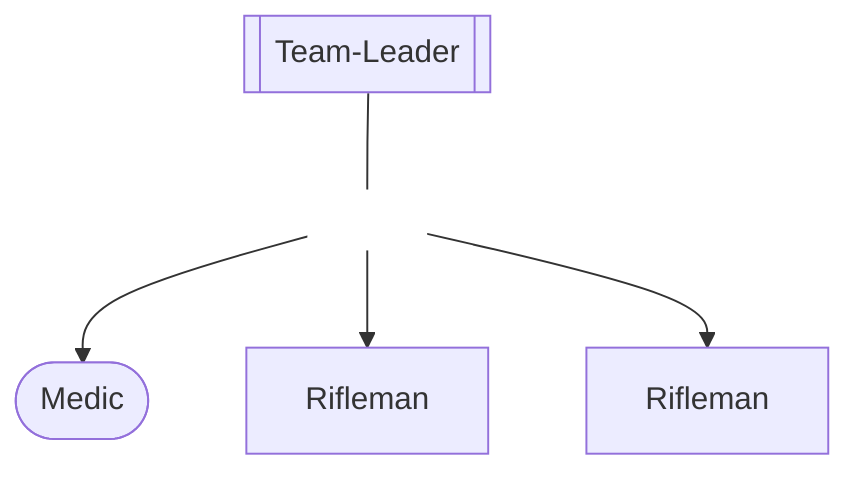
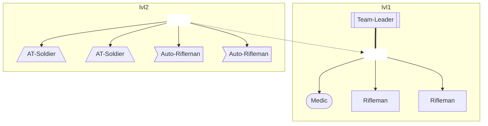
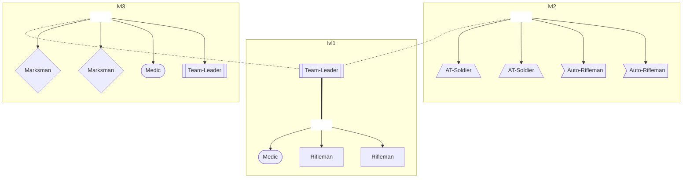
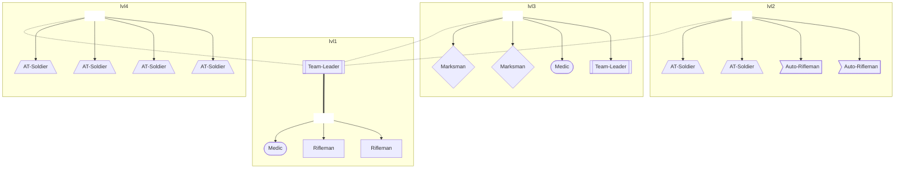
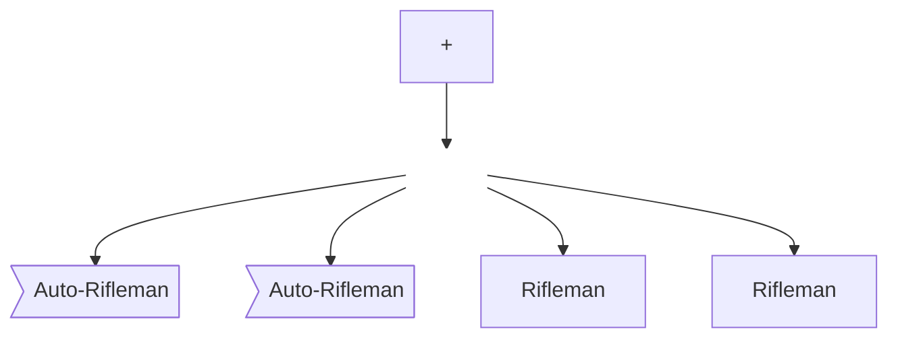

# Garrison Levels

## Short Description

## Advantages

### Commander

- less busy-work, click once per location instead of 4+ times

- easier to visualize on the map

- less confusion i.e. `What is better to use a Rifleman or a Team-Leader?`

- lower learning curve

### Players

- not a lot will change for them

- less frustration that commander set "bad" garrison.
    ****CAVE:****
    > ***Weak Argument**, seldom ever saw it happen or saw complaining happen*

### Server

- prevention of garrison spam could lead to better performance

- calculation of attack targets could become easier

### Dev

- removal of UI elements simplifies code and makes it more maintainable

- easier to balance against finite levels vs analog garrison strength

## Implementation

### Required Changes

#### Save-Data Changes

#### UI Changes

#### Code Changes

### Gameplay

### Configurable Parts

- deactivation of the garrison-level-system and fallback to the old system. In this case the level of the Location would be stored as `-1`

- max-level vs unlimited-level. Unlimited would just add a fixed array of soldiers to that location after it reached a level above the defined levels. Max would just not let the Commander add more levels.

### Examples

#### Levels

##### Level `-1`

Indicates that the garrison-level-system is deactivated. see [Configurable Parts](#Configurable-Parts)

##### Level `0`

Indicates no garrison

##### Level `1`

##### Level `2`

##### Level `3`

##### Level `4`

##### Level `4+`

## Further Ideas
